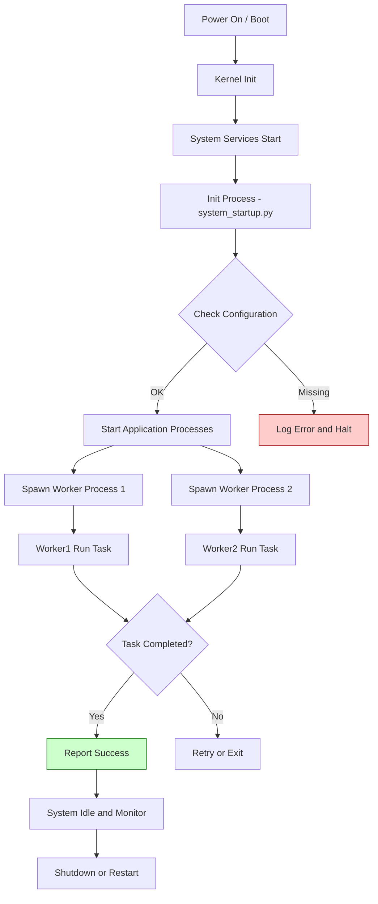

## OS Lab Assignment 2 - Process Startup and Lifecycle

This repository contains the code and documentation for the Operating Systems lab assignment (ID: 2301420022). The project demonstrates a minimal system startup and process lifecycle using Python scripts included in this folder.

### Contents

- `system_startup.py` - A more featureful system startup simulation.
- `system_startup_minimal.py` - A minimal demonstration of system startup and simple process/workflow.
- `OS_Lab_Assignment 2 .docx` - Lab writeup (student submission).
- `process log1.png`, `process log 2.png` - Process logs / screenshots for the assignment.

### Purpose / Contract

- Inputs: None (scripts are self-contained). Optionally environment or CLI flags in the future.
- Outputs: Console logs that show the simulated startup sequence and process lifecycle, plus log images included in the repo.
- Success: Scripts run without syntax errors and produce the expected sequence of steps in the logs.

Edge cases considered:

- Missing files: Scripts should fail gracefully with clear error messages.
- Long-running processes: Simulation uses sleep/delays but keeps durations short.

### Process Flow (Mermaid)

Below is a visual process flow for the system startup and process lifecycle. The chart is written in Mermaid syntax and can be rendered on GitHub or in editors that support Mermaid.



### How to run

Open a terminal in the repository root and run one of the Python scripts. Example (Windows PowerShell):

```powershell
python .\system_startup_minimal.py
python .\system_startup.py
```

### Git / Remote

This README was added and the repository can be pushed to the remote GitHub repository at:

https://github.com/yatharthchopra2424/OS_Lab_Assignment_2_2301420022

### Notes

- Mermaid diagrams render on GitHub and many editors that support Mermaid. If your environment doesn't render Mermaid, you can view the diagram using an online Mermaid live editor.
- If you want me to add a generated PNG of the Mermaid chart, I can generate it and commit it.

---

Completion status:

- README.md created with Mermaid process-flow chart.
