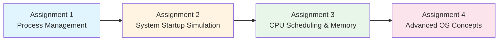

# Operating Systems Lab Assignments

**Student Details**  
**Name:** Yatharth Chopra  
**Course:** BTech CSE Data Science, Semester 5  
**Roll No:** 2301420022  
**Repository:** [OS-Assignment_2301420022_Sem_V](https://github.com/yatharthchopra2424/OS-Assignment_2301420022_Sem_V)

---

## 📚 Assignments Overview

This repository contains all Operating Systems lab assignments completed during Semester 5. Each assignment focuses on different core OS concepts and their practical implementation.



---

## 📂 Assignment Structure

### Assignment 1: Process Management
**Focus:** Process creation, execution, and lifecycle management

**Files:**
- `process_management.py` - Main implementation script
- `output.txt` - Sample execution output
- `README.md` - Detailed assignment documentation
- `OS_Lab_Assignment 1.docx` - Assignment specifications
- `report.pdf` - Comprehensive lab report
- Screenshots: Output captures (4 files)

**Topics Covered:**
- Process creation using fork()
- Command execution with exec()
- Zombie and orphan process simulation
- Process information inspection via /proc
- Process prioritization with nice values

---

### Assignment 2: System Startup Simulation
**Focus:** Boot sequence and initialization process simulation

**Files:**
- `system_startup.py` - Full startup simulation implementation
- `system_startup_minimal.py` - Minimal version of startup simulation
- `README.md` - Assignment documentation
- `OS_Lab_Assignment 2.docx` - Assignment specifications
- Screenshots: Process logs (2 files)

**Topics Covered:**
- Boot sequence simulation
- System initialization
- Service startup management
- Process logging and monitoring

---

### Assignment 3: CPU Scheduling & Memory Management
**Focus:** Scheduling algorithms and memory allocation techniques

**Files:**
- `Task-1-scheduling.py` - CPU scheduling algorithms implementation
- `Task-4-memory-allocation.py` - Memory allocation strategies
- `Task-5-mft-mvt-simulation.py` - Fixed and variable partition techniques
- `Output Screenshorts/` - Organized screenshots by task
  - Task-1-scheduling/ (3 images)
  - Task-4-memory-allocation/ (3 images)
  - Task-5-mft-mvt-simulation/ (3 images)

**Topics Covered:**
- CPU Scheduling Algorithms (FCFS, SJF, Round Robin, Priority)
- Memory allocation strategies (First Fit, Best Fit, Worst Fit)
- Fixed Partition (MFT) vs Variable Partition (MVT)
- Memory fragmentation analysis

---

### Assignment 4: Advanced Operating Systems Concepts
**Focus:** System calls, IPC, VM detection, and comprehensive scheduling

**Directory Structure:**
```
Assignment - 4/
├── task1_batch/              # Batch processing scripts
│   ├── batch_run.py
│   ├── script1.py
│   ├── script2.py
│   └── script3.py
├── task2_startup_logging/    # System startup and logging
│   └── startup_logging.py
├── task3_syscalls_ipc/       # System calls and IPC
│   ├── os_ipc.c              # C implementation
│   ├── os_ipc               # Compiled binary
│   └── py_pipe_fork.py      # Python implementation
├── task4_vm_detection/       # Virtual machine detection
│   ├── vm_detect.py
│   └── sysinfo.sh
├── task5_cpu_scheduling/     # CPU scheduling simulator
│   └── scheduling.py
├── outputs/                  # All task outputs
│   ├── system_log.txt
│   ├── task1_batch_output.txt
│   ├── task2_console.txt
│   ├── task3_exec.txt
│   ├── task3_pipe.txt
│   ├── task4_sysinfo.txt
│   ├── task4_vmdetect.txt
│   ├── task5_fcfs.txt
│   ├── task5_priority.txt
│   ├── task5_rr.txt
│   └── task5_sjf.txt
├── screenshots/              # Visual documentation (13 images)
├── run_all.sh               # Master execution script
└── README.md                # Assignment documentation
```

**Topics Covered:**
- Batch processing and automation
- System startup sequence and logging
- System calls and Inter-Process Communication (IPC)
- Pipes, fork, and process execution
- Virtual machine detection techniques
- Comprehensive CPU scheduling implementations
- Shell scripting and automation

---

## 🚀 How to Run

### General Requirements
- Python 3.x
- GCC compiler (for C programs)
- Linux/Unix environment (recommended) or WSL on Windows
- Bash shell (for shell scripts)

### Running Individual Assignments

**Assignment 1:**
```bash
cd "Assignment - 1"
python process_management.py
```

**Assignment 2:**
```bash
cd "Assignment - 2"
python system_startup.py
# or for minimal version
python system_startup_minimal.py
```

**Assignment 3:**
```bash
cd "Assignment - 3"
python Task-1-scheduling.py
python Task-4-memory-allocation.py
python Task-5-mft-mvt-simulation.py
```

**Assignment 4:**
```bash
cd "Assignment - 4"
# Run all tasks at once
bash run_all.sh

# Or run individual tasks
python task1_batch/batch_run.py
python task2_startup_logging/startup_logging.py
gcc task3_syscalls_ipc/os_ipc.c -o task3_syscalls_ipc/os_ipc
./task3_syscalls_ipc/os_ipc
python task4_vm_detection/vm_detect.py
python task5_cpu_scheduling/scheduling.py
```

---

## 📊 Key Learnings

- **Process Management**: Understanding process lifecycle, creation, and termination
- **System Programming**: Working with system calls and low-level operations
- **Scheduling Algorithms**: Implementing and comparing different CPU scheduling techniques
- **Memory Management**: Allocation strategies and fragmentation handling
- **Inter-Process Communication**: Pipes, shared memory, and message passing
- **System Monitoring**: Process information extraction and system state analysis
- **Automation**: Shell scripting and batch processing

---

## 📖 References

- Operating System Concepts by Silberschatz, Galvin, and Gagne
- Modern Operating Systems by Andrew S. Tanenbaum
- Linux System Programming by Robert Love
- Python `os` and `subprocess` module documentation
- Linux `/proc` filesystem documentation
- POSIX system calls reference

---

## 📝 Documentation

Each assignment folder contains:
- Individual `README.md` with specific task details
- Source code files with inline comments
- Output files demonstrating execution results
- Screenshots for visual reference
- Assignment specification documents

---

## 🔗 Repository Information

**GitHub Repository:** https://github.com/yatharthchopra2424/OS-Assignment_2301420022_Sem_V

**Last Updated:** November 2025

---

## 📧 Contact

For any queries regarding these assignments:
- **Student:** Yatharth Chopra
- **Roll No:** 2301420022
- **Course:** BTech CSE Data Science, Semester 5